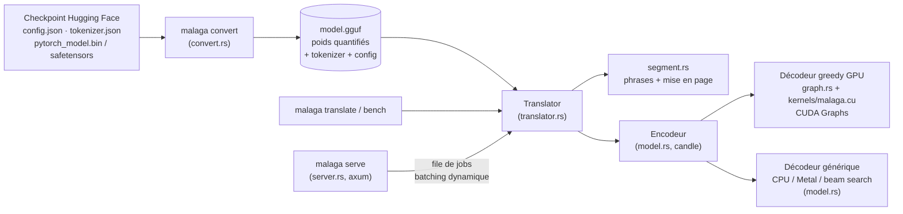

# Architecture

## Vue d'ensemble

Stack : Rust 1.97, [candle](https://github.com/huggingface/candle) 0.11 (tenseurs, matmul
quantifiés MMVQ/MMQ issus de llama.cpp, cuBLAS), noyaux CUDA maison compilés en PTX par `nvcc`,
[tokenizers](https://github.com/huggingface/tokenizers), axum/tokio pour le serveur.

| Crate / fichier | Rôle |
|---|---|
| `crates/malaga-core` | Bibliothèque : conversion, modèle, décodage, traduction |
| `src/config.rs` | Hyper-paramètres NLLB, lus depuis `config.json` ou la métadonnée GGUF |
| `src/convert.rs` | HF → GGUF : quantification, fusion QKV, pré-mise à l'échelle, shortlist |
| `src/model.rs` | Transformer M2M100 : encodeur, décodeur générique, pas statique fusionné |
| `src/graph.rs` | Décodage greedy GPU sur buffers fixes, capture/rejeu en CUDA Graphs, cache LRU |
| `src/kernels.rs`, `kernels/malaga.cu` | Noyaux CUDA fusionnés et leurs lanceurs |
| `src/translator.rs` | Tokenisation, batchs, budgets de longueur, beam search, repli OOM |
| `src/segment.rs`, `src/langs.rs` | Découpage en phrases ; alias de langues |
| `crates/malaga` | Binaire : `convert`, `translate`, `bench`, `serve` |

## Le modèle

NLLB-200 = architecture M2M100 : transformer encodeur-décodeur pré-LayerNorm, embeddings partagés
(et liés à la tête de sortie, 256 206 tokens × `d_model`), positions sinusoïdales fairseq
(décalage `padding_idx + 1`), ReLU. Le malgache est la langue `plt_Latn`. Le décodage commence
par `</s>` puis le code de la langue cible (forced BOS), comme dans `transformers`.

## Format GGUF

`general.architecture = "nllb"`. Métadonnées `nllb.*` (dimensions), `tokenizer.ggml.*` (ids
spéciaux) et `tokenizer.huggingface.json` (le tokenizer complet). Tenseurs :

| Nom | Contenu |
|---|---|
| `token_embd.weight` | embeddings partagés = tête de sortie |
| `{enc,dec}.blk.N.attn_qkv` | Q, K, V fusionnés ; Q (poids et biais) pré-multiplié par `1/√head_dim` |
| `{enc,dec}.blk.N.attn_out`, `ffn_up`, `ffn_down`, `*_norm` | projections et LayerNorm |
| `dec.blk.N.cross_attn_q`, `cross_attn_kv`, `cross_attn_out` | attention croisée (K, V fusionnés) |
| `lm_head.<lang>.weight` + `nllb.shortlist.<lang>` | optionnel : shortlist du mode `--fast-vocab` |

Normes et biais restent en f32 ; les presets `_m` gardent embeddings et `ffn_down` en Q6_K.

## Chemin rapide GPU (greedy)

1. **Encodeur** (une fois par batch) : opérations candle ; les K/V de l'attention croisée de toutes
   les couches sont projetés une seule fois.
2. **État statique** (`StaticState`) : token courant, position, KV-cache `[b, h, m, hd]` en f16,
   K/V croisés, sorties — tout reste sur le GPU, formes fixes par bucket (batch arrondi à la
   puissance de 2 avec lignes inactives, source et budget de sortie en puissances de 2).
3. **Pas de décodage fusionné** (~19 lancements par couche au lieu de ~38) :
   `embed_pos_ln` (embedding × échelle + position + LayerNorm), `qkv_decode` (biais + écriture
   KV-cache à la position lue sur le GPU), `attn_decode` (attention mono-requête complète),
   `bias_residual_ln` (biais + résiduel + LayerNorm suivante), `bias_relu`, matmul quantifiés
   MMVQ, puis `argmax_partial` + `greedy_finalize` (argmax parallèle, gestion fin de séquence,
   écriture du token, incrément de position).
4. **CUDA Graph** : ce pas ne dépend d'aucune donnée hôte, il est capturé une fois puis rejoué —
   un lancement par token. Le CPU ne se synchronise qu'une fois tous les 4 tokens pour tester la fin.
5. **Repli** : sur manque de VRAM, les graphes sont libérés (`cuDeviceGraphMemTrim`) et le même pas
   fusionné tourne sans capture ; les batchs sont divisés par deux si nécessaire.

Le décodeur générique (`Nllb::decode`) reste la référence : le test
`fused_gpu_decoding_matches_the_reference_path` exige des tokens identiques.

## Serveur

Un thread d'inférence possède le modèle. Les handlers HTTP envoient des jobs dans une file ; le
thread prend tous les jobs en attente, les groupe par (source, cible, beam) et traduit chaque
groupe en un seul batch. Une requête isolée part immédiatement (aucune attente artificielle).
