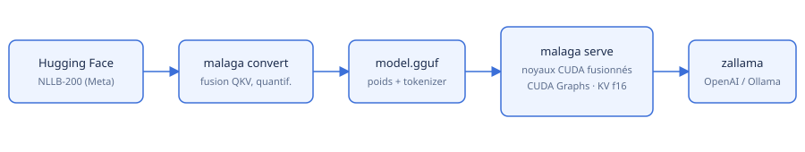

# malaga — portfolio

**Traduire le français et l'anglais vers le malgache, vite, sur un seul GPU partagé.**

- **Objectif** : rendre la traduction automatique vers le malgache utilisable en temps réel et
  auto-hébergée, avec la qualité des meilleurs modèles ouverts (NLLB-200 de Meta).
- **Public cible** : développeurs et équipes produisant du contenu pour Madagascar (sous-titres,
  documents, assistants), administrateurs d'une instance zallama.
- **Contexte** : brique de la Ze Family d'outils auto-hébergés ; hébergée par zallama aux côtés
  de parakeet (reconnaissance vocale) et d'un modèle de vision sur un même GPU.

malaga porte les modèles NLLB-200 de Meta en Rust et en GGUF : un fichier par modèle, un binaire
unique, une API compatible OpenAI / Ollama, et un hébergement prévu dans zallama à côté de
modèles de reconnaissance vocale et de vision.



## Scénarios d'usage

1. **Sous-titrage malgache** : parakeet (ASR) transcrit une vidéo en français, malaga traduit
   chaque segment en malgache via `/v1/translate` (batch), en quelques millisecondes par segment.
2. **Assistant multilingue** : un client OpenAI appelle `model: "malaga-fr-mg"` dans zallama comme
   n'importe quel modèle de chat.
3. **Traduction de documents** : `malaga translate -f en < rapport.txt` conserve paragraphes et
   retours à la ligne.

## Architecture

Rust · candle (CUDA / Metal / CPU) · noyaux CUDA fusionnés · CUDA Graphs · axum.
Détails : [docs/architecture.md](../docs/architecture.md).

## Métriques (RTX 4090, NLLB-200 600M q4_k_m)

| | |
|---|---|
| Latence d'une phrase | **16,4 ms** (vs 31,8 ms pour un portage direct) |
| Décodage | 0,78 ms / token |
| Débit (batch 16) | 363 phrases/s — FLORES-200 complet (1012 phrases) en ~5 s |
| VRAM totale | 1,2 Go (contexte CUDA compris) |
| Qualité FLORES fr→mg | chrF++ 44,7 — identique à f32 / `transformers` (p > 0,05) |

Méthode et historique : [docs/performance.md](../docs/performance.md).

## Démo

```console
$ malaga translate -m nllb-200-distilled-600M-q4_k_m.gguf "Madagascar est une grande île située dans l'océan Indien."
Nosy lehibe any amin'ny Ranomasimbe Indianina i Madagasikara.
$ curl -s localhost:8080/v1/translate -d '{"text":"Merci beaucoup pour votre aide."}' -H 'content-type: application/json'
{"translation":"Misaotra betsaka anao noho ny fanampianao.","source":"fr","target":"mg",...}
```

## Liens

- Dépôt : https://github.com/rzafiamy/malaga
- Documentation : [README](../README.md), [docs/](../docs/architecture.md)
- Releases : https://github.com/rzafiamy/malaga/releases
- Issues : https://github.com/rzafiamy/malaga/issues
- Modèle d'origine : https://huggingface.co/facebook/nllb-200-distilled-600M
